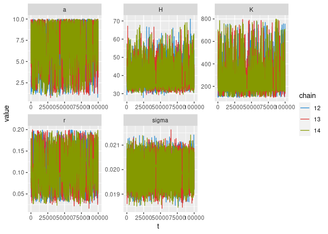

Appendix
================
Carl Boettiger

``` r
library(knitr)
library(ggthemes)
library(tidyverse)
library(transformr)

# greta::install_greta_deps()
#greta_notes_install_miniconda_error()
#greta_notes_conda_create_error()
#theme_set(theme_solarized(base_size=16))
scale_colour_discrete <- function(...) scale_colour_solarized()
scale_fill_discrete <- function(...) scale_fill_solarized()
pal <- solarized_pal()(7)
txtcolor <- "#586e75"

#library(greta)
#tensorflow::use_session_with_seed(12345)
```

``` r
p <- list(r = .05, K = 200, Q = 5, H = 38, sigma = .02, a=2.3, N = 3e3, x0 = 20)
horizon <- 50
```

``` r
growth <- function(x, p) x * p$r * (1 - x / p$K)
consumption <- function(x, p) p$a * x ^ p$Q / (x^p$Q + p$H^p$Q)
may <- function(x, p) x + growth(x,p) - consumption(x,p)
```

``` r
# Generic simulator routine
sim <- function(f, p){
  x <- numeric(p$N)
  x[1] <- p$x0
  dBt <- numeric(p$N)
  if(p$sigma > 0) dBt <- rnorm(p$N, 0, p$sigma)
  for(t in 1:(p$N-1)){
    x[t+1] <- max(f(x[t], p) + x[t] * dBt[t], 0)
  }
  tibble(t = 1:p$N, x)
}
```

``` r
set.seed(111111)
sim_df <-  sim(may, p)
train <- sim_df %>% filter(t < 1500) %>% mutate(line = "training data")

# inspect data
# sim_df %>% ggplot(aes(t,x)) + geom_point()
# train %>% ggplot(aes(t,x)) + geom_point()
```

``` r
#plan("multisession")
p1 <- p
p1$x0 <- train[[length(train$x),"x"]]
p1$N <- horizon

ideal_forecast <- 
  map_dfr(1:100, 
                 function(reps) sim(may, p1), .id = "reps") %>% 
  mutate(t = t + horizon, 
         line = "ideal forecast")
```

# Model-based forecast

``` r
library(greta)
```

    ## 
    ## Attaching package: 'greta'

    ## The following object is masked from 'package:dplyr':
    ## 
    ##     slice

    ## The following objects are masked from 'package:stats':
    ## 
    ##     binomial, cov2cor, poisson

    ## The following objects are masked from 'package:base':
    ## 
    ##     %*%, apply, backsolve, beta, chol2inv, colMeans, colSums, diag,
    ##     eigen, forwardsolve, gamma, identity, rowMeans, rowSums, sweep,
    ##     tapply

Bayesian estimate on training data only:

``` r
wide <- select(train, x) %>% as.matrix() 
n <- dim(wide)[1]
x_t1 <- wide[-1,]
x_t <- wide[-n,] 
```

``` r
a <- uniform(0, 10)
```

    ## ℹ Initialising python and checking dependencies, this may take a moment.

    ## ✓ Initialising python and checking dependencies ... done!

    ## 

``` r
r <- uniform(0, 4 * p$r)
Q <- uniform(0, 4 * p$Q)
K <- uniform(0, 4 * p$K)
H <- uniform(0,  4 * p$H)
sigma <- uniform(0, 4 * p$sigma)

# Model   (mean <-  may(x_t, p))
mean <- x_t + r * x_t * (1 - x_t / K) - a * x_t ^ Q / (x_t ^ Q + H ^ Q)
distribution(x_t1) <- normal(mean, sigma * x_t)

m <- model(a, r, K, H, sigma)
```

``` r
system.time({
  draws <- mcmc(m, n_samples = 10000, warmup = 3000, chains = 60, verbose = FALSE)
})
```

    ##      user    system   elapsed 
    ## 20958.904  2800.903   829.754

``` r
samples <-  
  map_dfr(draws, 
          function(x) data.frame(x, t = 1:dim(x)[1]), 
          .id = "chain") %>% 
  gather(variable, value, -t, -chain)
```

``` r
#Q = 5
true <- 
  as_tibble(p) %>% select(-N, -x0, -Q) %>%
  gather(variable, value)
```

``` r
samples %>% ggplot() + 
  geom_histogram(aes(value), bins = 30)  +
  geom_vline(data = true, aes(xintercept = value), col = "red", lwd = 1) + 
  facet_wrap(~variable, scales = "free")
```

<!-- -->

Replicate simulations of stochastic model with parameters drawn from
posteriors

(would be great to have a `greta` method for this…)

``` r
#q <- posterior_samples[1,] %>%  mutate(N=1e3, x0 = x0, Q = p$Q)
#sim(may, q)

#posterior_sims <- map_dfr(a, function(a){
#  p$a <- a
#  sim(may, p)
#},
#.id = "reps")
```

``` r
alpha <- 0.1
training_data <- train %>% select(t,x) %>% mutate(reps="1") #, set = "training")
h <- nrow(training_data %>% filter(reps=="1"))
x0 <- training_data %>% filter(reps == 1, t == max(t)) %>% pull(x)

p$x0 <- x0
p$N <- 1e3
true_forecast <- 
  map_dfr(1:100, 
                 function(reps) sim(may, p), 
                 .id = "reps"
                 ) %>% 
  mutate(t = t+h) %>% 
  bind_rows(training_data) %>% 
  mutate(set = "true")
```

``` r
#a <- unname(sample(unlist(draws, TRUE), 100))

posterior_samples <- 
  bind_rows(map(draws, as_tibble)) %>% 
  sample_n(100)

posterior_sims <- posterior_samples %>%
  mutate(N=1e3, x0 = x0, Q = p$Q) %>% 
         ## sigma = p$sigma, H = p$H, K = p$K, r = p$r) %>%
  purrr::transpose() %>%
  map_dfr(function(q) sim(may, q) ,.id = "reps")
```

``` r
predicted_forecast <- 
  posterior_sims %>% 
    mutate(t = t+h) %>%
    bind_rows(training_data) %>% 
    mutate(set = "predicted")
```

``` r
model_forecast <- bind_rows(predicted_forecast, true_forecast)
write_csv(model_forecast, "model_forecast.csv.gz")

model_forecast %>% 
#predicted_forecast %>%
  ggplot(aes(t,x)) +
  geom_line(aes(group = interaction(reps, set), col = set), alpha = .1) + 
  geom_line(data = training_data) + 
  facet_wrap(~set) + 
  scale_color_solarized()
```

<!-- -->
